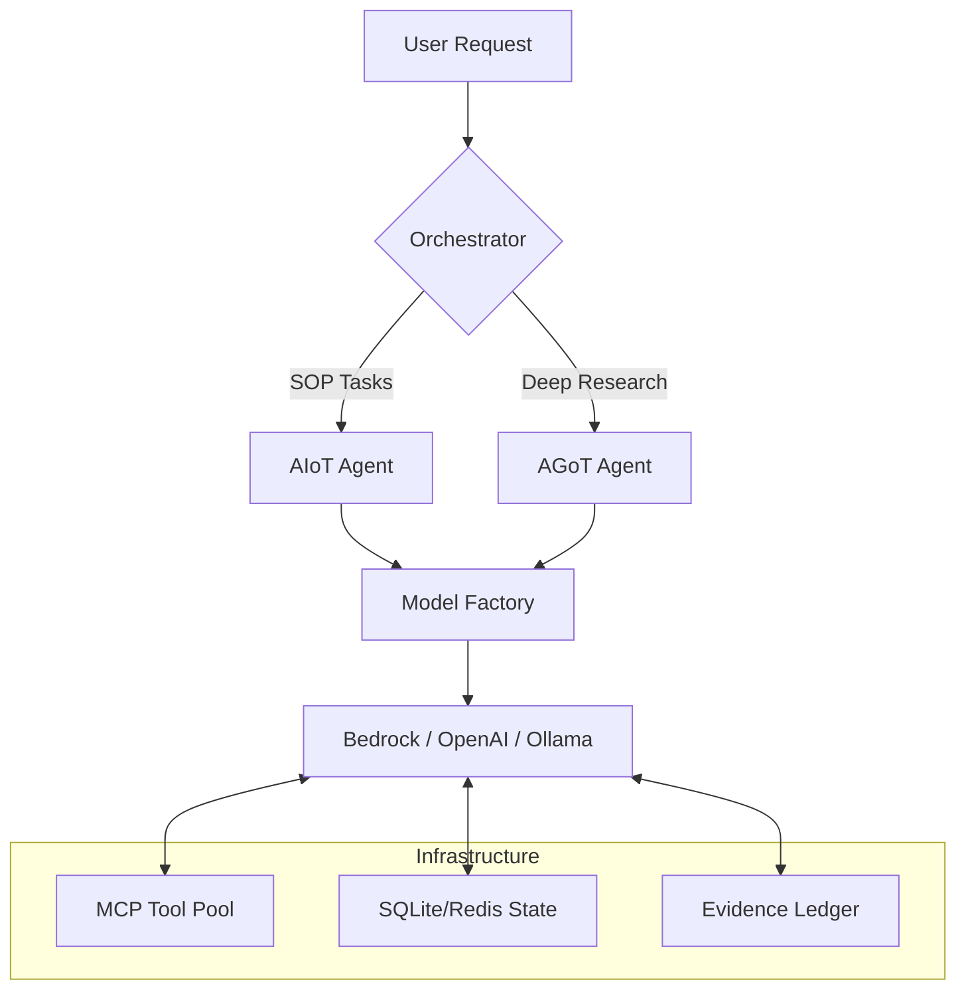

# AnyMind: Provider-Agnostic Agentic Orchestration Engine

[](https://github.com/yourusername/anymind/actions/workflows/ci.yml)
[](https://opensource.org/licenses/MIT)

AnyMind is a high-performance, **provider-agnostic** multi-agent runtime designed to operationalize complex, goal-directed AI workflows. It implements state-of-the-art reasoning topologies—including **Autonomous Iteration of Thought (AIoT)** and **Adaptive Graph of Thoughts (AGoT)**—to bridge the gap between simple LLM prompting and production-grade autonomous systems.

---

## 🚀 Why AnyMind?

Modern AI engineering faces three critical bottlenecks:
1.  **Vendor Lock-in**: Hard-coding to a single LLM provider (OpenAI, Anthropic, Google) creates massive execution risk.
2.  **Reasoning Inefficiency**: Standard "one-shot" responses fail at complex synthesis or multi-step logic.
3.  **Context Exhaustion**: Maintaining long-horizon goals across turns requires structured state management, not just "naive context window dumping."

AnyMind solves these by abstracting the model layer and providing specialized "cognitive architectures" tailored to specific problem domains—from deterministic SOP compliance to exploratory research synthesis.

---

## 🏗️ Architecture Overview

AnyMind operates as a **modular orchestration layer** between your domain-specific tools and the evolving landscape of foundation models.



### Key Technical Pillars:
-   **Model Factory Pattern**: Dynamic selection and pooling of LLM clients across Bedrock, OpenAI, and Ollama.
-   **Cognitive Orchestrations**: 
    -   **AGoT (Adaptive Graph of Thoughts)**: Recursively expands reasoning nodes only when "complexity checks" are triggered, optimizing test-time compute.
    -   **AIoT (Autonomous Iteration of Thought)**: Self-terminating inner dialogue loops with deterministic `iteration_stop` signals.
-   **Evidence Ledger & Citations**: Every tool interaction is recorded in an immutable ledger, and final responses are automatically rewritten to include evidence-backed citations `[E1]`.

---

## 🛠️ Comparison: Why this over alternatives?

| Feature | AnyMind | LangChain / CrewAI | Static Agents |
| :--- | :--- | :--- | :--- |
| **Provider Agnostic** | ✅ Native Abstraction | ⚠️ Heavy Dependencies | ❌ No |
| **Reasoning Topology** | AGoT, AIoT, GoT | Linear / Tree-only | ❌ One-shot |
| **Compute Optimization** | Adaptive (test-time) | ❌ Static Loops | ❌ No |
| **System Integrity** | Integrated Hooks | ❌ No | ❌ No |
| **State Management** | Git-native / SQLite | ⚠️ Basic Memory | ❌ None |

---

## 📖 In-Depth Strategy (ADRs)

Design decisions are captured as **Architecture Decision Records (ADRs)** to provide full transparency on the trade-offs navigated during development:

-   [ADR 001: Provider-Agnostic Model Orchestration](docs/adr/001-provider-agnostic-design.md)
-   [ADR 002: Selection of Reasoning Topologies](docs/adr/002-reasoning-topologies.md)
-   [ADR 003: Dichotomy of SOP and Research Orchestrations](docs/adr/003-sop-vs-research-orchestrations.md)

---

## ⚡ Quick Start

### Installation
```bash
poetry install
# For semantic search consensus support
poetry install --with onnx
python onnx_assets/build.py
```

### Running the CLI
```bash
# Research mode (exploratory)
poetry run anymind --agent research_director -q "Compare recent CPI trends across G7 nations"

# SOP mode (deterministic)
poetry run anymind --agent sop_agent -q "Review the latest PDF security logs for anomalies"
```

### API Server (Swagger at `/docs`)
```bash
poetry run anymind serve --host 0.0.0.0 --port 8000
```

---

## 📝 Configuration

AnyMind utilizes a flexible, hierarchical JSON configuration system. See `config/` for examples:
- `config/model.openai.json`
- `config/model.bedrock.json`
- `config/mcp_servers.json`

---

## 🧪 Development & Quality

AnyMind maintains a high technical bar for production readiness:
- **Testing**: `pytest` for unit and integration tests.
- **Observability**: Built-in latency tracking and token usage reporting.
- **Safety**: Automated quality checks via `pre-commit` (black, bandit, pip-audit).

---

© 2026 AnyMind Project. Built for the era of autonomous systems.
