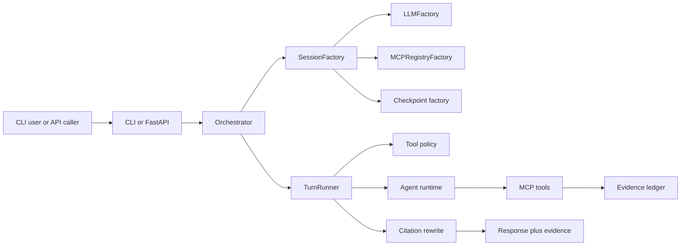

# AnyMind

AnyMind is a provider-agnostic multi-agent orchestration runtime with a CLI, a FastAPI service, MCP tool integration, evidence capture, citation rewriting, and multiple reasoning strategies. It lets you route the same workload through AIoT, GIoT, AGoT, GoT, the research agent, or the SOP agent without hard-coding to one model vendor.

Search terms: multi-agent orchestration, provider-agnostic AI agents, LangGraph runtime, AIoT, GIoT, AGoT, Graph of Thoughts, MCP tools, evidence-backed agents, FastAPI AI agent server.

## Why AnyMind

- Switch model providers through JSON config. The runtime builds chat models through LangChain's `init_chat_model`, and the repo ships example configs for OpenAI, AWS Bedrock, and Ollama.
- Choose the reasoning shape that matches the job. Simple iterative workflows, parallel temperature sweeps, graph-based reasoning, research decomposition, and SOP execution all live behind one runtime.
- Keep tool use grounded. MCP tool results are intercepted, logged, and added to an evidence ledger before optional citation rewriting.
- Reuse the same orchestration core from the terminal or over HTTP. The CLI and the FastAPI app both go through the same `Orchestrator`.
- Control tool exposure at runtime. Tool policies support always-on, planner-selected, confirm-before-run, and no-tools modes.

## Quick Start

Install the project:

```bash
poetry install
```

Optional: build ONNX assets for semantic similarity helpers used by some reasoning flows and the bundled local MCP tools:

```bash
poetry install --with onnx
python onnx_assets/build.py
```

Run the research agent from the CLI:

```bash
poetry run anymind --agent research_agent -q "Compare recent CPI trends across G7 nations"
```

Run the SOP agent with a JSON file:

```bash
poetry run anymind --agent sop_agent -q "@/absolute/path/to/sop.json"
```

Start the FastAPI service:

```bash
poetry run anymind serve --host 0.0.0.0 --port 8000
```

If you plan to use the bundled `internet_search` MCP tool, configure search credentials first:

- Kagi: set `KAGI_API_KEY` or populate `search.kagi_api_key` in the model config
- Scrapfly: set `SCRAPFLY_API_KEY` or `SCRAPFLY_API_KEY_SECRET_ARN`

Without those credentials, the bundled `local_tools` server does not register `internet_search`. `pdf_extract_text` and `current_time` do not require those search API keys.

## Agent Catalog

| Agent name | Purpose |
| --- | --- |
| `research_agent` | Plans probe batches and delegates sub-questions to other reasoning runtimes before synthesizing a final answer. |
| `sop_agent` | Executes JSON SOP graphs, optionally optimizes them, and can choose per-node solving algorithms. |
| `aiot_agent` | Brain/worker loop with validated JSON outputs and optional tool use. |
| `giot_agent` | Multi-agent iteration with temperature variation and facilitator-style convergence. |
| `agot_agent` | Adaptive graph-of-thought execution with planner and worker pools. |
| `got_agent` | Graph-of-thought search with branching, reflection, verification, and optional tool workers. |

## Architecture Snapshot



The HTTP path adds a `SessionStore` and `JobManager`, but the core turn execution path stays the same.

## Docs Map

- [Getting Started](docs/getting-started.md): installation, config selection, CLI use, API startup, and tests.
- [Architecture](docs/architecture.md): session lifecycle, tool interception, agent runtime flow, and persistence model.
- [Reference](docs/reference.md): commands, agents, config discovery, tool policies, built-in MCP tools, and environment variables.
- [ADR 001](docs/adr/001-provider-agnostic-design.md): provider abstraction rationale.
- [ADR 002](docs/adr/002-reasoning-topologies.md): why multiple reasoning topologies exist.
- [ADR 003](docs/adr/003-sop-vs-research-orchestrations.md): split between research and SOP execution.

## Current Implementation Notes

- The default checkpoint backend is SQLite when the async SQLite saver is available, with in-memory fallback otherwise.
- Redis caching is supported for usage and tool-result caching, but Redis is not currently a configured checkpoint backend.
- The bundled `local_tools` MCP server always exposes `current_time` and `pdf_extract_text`, and conditionally exposes `internet_search`.
- `internet_search` is only registered by the bundled `local_tools` server when Kagi and Scrapfly credentials are available at process start.
