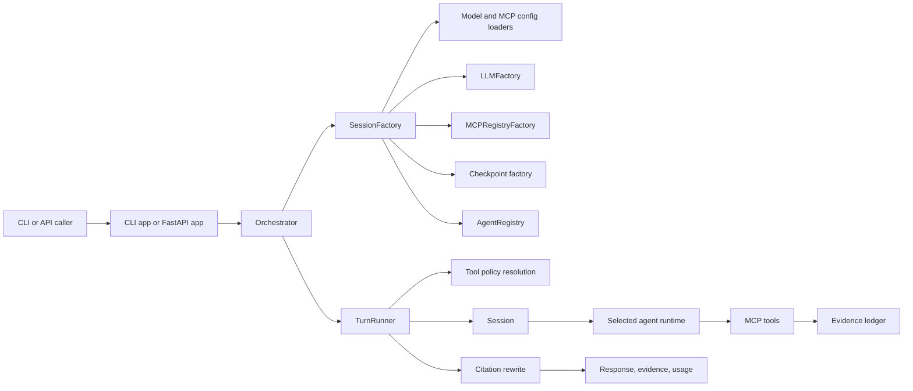

# AnyMind Architecture

AnyMind is a runtime layer around model selection, MCP tool access, multiple reasoning strategies, and evidence-aware response generation.

## Runtime Topology

The API path adds a `SessionStore` and `JobManager` for long-lived thread IDs and asynchronous jobs, but those components still call back into the same `Orchestrator`.

## Session Creation

`SessionFactory` is the main composition point.

1. Load the model config and MCP config.
2. Apply Kagi search config into the process environment when present.
3. Create the model client through `LLMFactory`.
4. Resolve the active tool policy.
5. Build MCP registries with interceptors for logging, evidence capture, optional cache, confirmation, and Bedrock result normalization.
6. Create a checkpoint saver.
7. Build the requested agent runtime twice when needed: one version with tools and one without.

The resulting `Session` holds the model client, tools, evidence ledger, checkpoint objects, chat history, and a cache of agent runtimes keyed by the selected tool set.

## Turn Execution

`TurnRunner` owns a single user turn.

1. Check token budget state.
2. Start a new evidence-ledger turn.
3. Resolve the effective tool policy and selected tools.
4. Pick or build the correct agent runtime for the current tool set.
5. Invoke the runtime with the current user input and thread ID.
6. Collect new evidence records from intercepted tool calls.
7. Optionally rewrite the final answer with citations backed by the evidence ledger.
8. Return response text, evidence summaries, and usage metadata.

For `research_agent`, recent chat history is included so multi-turn research sessions can continue across turns.

## Agent Families

### `aiot_agent`

- Brain/worker loop.
- Uses validated JSON checkpoints to keep outputs structured.
- Tool-capable worker agent built with LangChain `create_agent`.

### `giot_agent`

- Runs several tool-capable worker agents at different temperatures.
- Uses a facilitator-style convergence step.
- Shares the same base model family but varies temperature per worker.

### `agot_agent`

- Separates planning from execution.
- Uses a pool of tool-capable worker agents for bounded parallelism.
- Stops when the usage tracker signals budget exhaustion.

### `got_agent`

- Builds graph-of-thought search state with optional embedding-assisted diversity handling.
- Uses tool workers only when tools are configured.

### `research_agent`

- Acts as a manager over the other reasoning runtimes.
- Generates probe questions, batches them, and routes each probe to AIoT, GIoT, AGoT, or GoT based on `select_brain_for_question`.
- Synthesizes the final answer after probe execution.

### `sop_agent`

- Accepts a JSON SOP payload or a `@path` reference.
- Validates and optionally optimizes the SOP graph.
- Solves nodes with one of the reasoning runtimes and can include evidence in node outputs.

## Tooling and Evidence

MCP tool calls flow through interceptors defined in [../src/anymind/runtime/mcp_registry.py](../src/anymind/runtime/mcp_registry.py).

Important interceptors:

- request/result logging
- evidence ledger capture
- optional cache wrapping
- optional terminal confirmation
- Bedrock tool-result sanitization

Evidence records are stored in-memory on the session and summarized for CLI/API output. When evidence exists, the turn runner can pass the draft answer plus evidence records into the citation renderer before responding.

## State Model

- Session objects live in memory.
- API thread continuity is handled by `SessionStore`, keyed by `(agent_name, thread_id)`.
- Checkpoints default to SQLite when the async SQLite saver is available.
- If the SQLite saver dependency is missing, the code falls back to in-memory checkpoints.
- Redis is used for usage and optional cache storage, not as the currently implemented checkpoint backend.

## Module Layout

| Path | Responsibility |
| --- | --- |
| `src/anymind/cli/main.py` | Terminal entry point and `serve` command. |
| `src/anymind/api/app.py` | FastAPI app, session store, and job endpoints. |
| `src/anymind/runtime/session_factory.py` | Model, tool, checkpoint, and agent composition. |
| `src/anymind/runtime/turn_runner.py` | Per-turn execution, evidence capture, and citation rewrite. |
| `src/anymind/runtime/mcp_registry.py` | MCP registry creation and tool interceptors. |
| `src/anymind/runtime/evidence.py` | Evidence ledger data model. |
| `src/anymind/agents/*.py` | Reasoning runtimes and orchestration strategies. |

## Architectural Boundaries

AnyMind is not a no-code agent builder and not a generic docs site generator. The codebase is focused on orchestrating model calls, tool access, and reasoning structure while staying close to the underlying LangChain and LangGraph primitives already in the repo.
